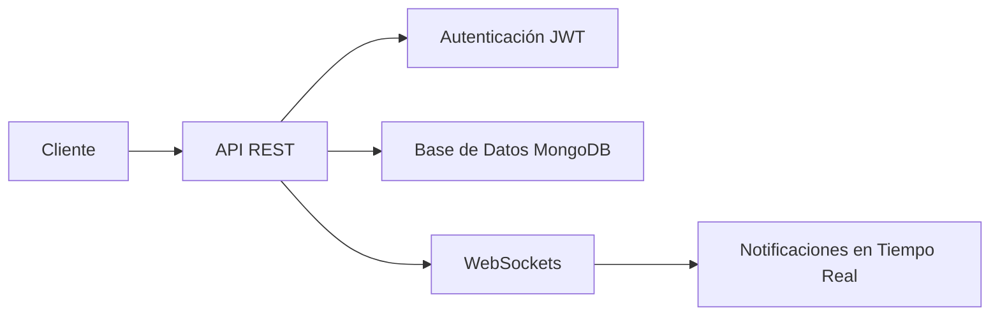

# 🚀 **Sistema de Gestión de Proyectos - API REST**

_Backend robusto para la gestión eficiente de proyectos, tareas y equipos_

---

## 🌟 **Tabla de Contenidos**

1. [🔗 URLs de Producción](#-urls-de-producción)
2. [🛠️ Stack Tecnológico](#-stack-tecnológico)
3. [📊 Diagrama de Arquitectura](#-diagrama-de-arquitectura)
4. [🔐 Autenticación y Roles](#-autenticación-y-roles)
5. [📚 Documentación Interactiva](#-documentación-interactiva)
6. [💻 Instalación Local](#-instalación-local)
7. [🧪 Testing y Coverage](#-testing-y-coverage)
8. [🤝 Contribuir](#-contribuir)
9. [📞 Contacto](#-contacto)

---

## 🔗 **URLs de Producción**

| **Entorno**     | **URL**                                                                                                                                                          | **Descripción**       |
| --------------- | ---------------------------------------------------------------------------------------------------------------------------------------------------------------- | --------------------- |
| **Frontend**    | [https://gestiondeproyectos.up.railway.app](https://gestiondeproyectos.up.railway.app)                                                                           | Interfaz de usuario   |
| **Backend API** | [https://back-endsistemadegestiondeproyectos-production.up.railway.app](https://back-endsistemadegestiondeproyectos-production.up.railway.app)                   | API REST principal    |
| **API Docs**    | [https://back-endsistemadegestiondeproyectos-production.up.railway.app/api-docs](https://back-endsistemadegestiondeproyectos-production.up.railway.app/api-docs) | Documentación Swagger |

---

## 🛠️ **Stack Tecnológico**

<div align="center">  
  
  
  
  
  
</div>

---

## 📊 **Diagrama de Arquitectura**



---

## 🔐 **Autenticación y Roles**

### **Credenciales de Prueba**

| Rol       | Email                            | Contraseña             |
| --------- | -------------------------------- | ---------------------- |
| Admin     | `admin@test.com`                 | `admin123`             |
| Manager   | `manager@test.com`               | `manager123`           |
| Developer | `dev@test.com`                   | `dev123`               |
| **Admin** | `gestiondeproyectos07@gmail.com` | `GestionProyectos123@` |

### **Flujo de Autenticación**

1. **Registro** → Verificación por email
2. **Login** → Genera Access + Refresh tokens
3. **Acceso** → Middleware de roles protegido

---

## 📚 **Documentación Interactiva**

Explora la API completa con **Swagger UI**:  
🔗 [http://localhost:5000/api-docs/#/](http://localhost:5000/api-docs/#/)

**Características:**  
✔ Prueba endpoints en vivo  
✔ Modelos de request/response  
✔ Ejemplos para cada operación

---

## 💻 **Instalación Local**

```bash
# 1. Clonar repositorio
git clone https://github.com/tu-usuario/gestion-proyectos.git
cd gestion-proyectos

# 2. Instalar dependencias
yarn install

# 3. Configurar entorno
cp .env.example .env  # Editar con tus credenciales

# 4. Iniciar servidor
yarn dev  # Desarrollo (con nodemon)
yarn start  # Producción
```

---

## 🧪 **Testing y Coverage**

```bash
# Ejecutar tests unitarios
yarn test

# Tests con hot-reload
yarn test:watch

# Reporte de cobertura
yarn test:coverage
```

**Cobertura actual:** 85% (Jest + Supertest)

---

## 🤝 **Contribuir**

1. 🍴 Haz un fork del proyecto
2. 🌿 Crea una rama: `git checkout -b feature/nueva-funcionalidad`
3. 💾 Commit: `git commit -m 'feat: añade X funcionalidad'`
4. 🚀 Push: `git push origin feature/nueva-funcionalidad`
5. 🔄 Abre un Pull Request

**Requisitos:**  
✓ Tests actualizados  
✓ Documentación coherente  
✓ Código limpio y comentado

---

## 📞 **Contacto**

**Daniel Amaya** - Desarrollador Backend  
📧 [danijcdm.com@gmail.com](mailto:danijcdm.com@gmail.com)

---

**Licencia MIT** © 2023 - [Ver licencia completa](LICENSE)
